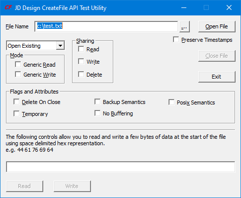

# CFTest - Windows GUI program to exercise the Win32 CreateFile API

CFTest lets you exercise the most common options you're likely to need with the [CreateFile API](https://learn.microsoft.com/en-us/windows/win32/api/fileapi/nf-fileapi-createfilea).

- Open and close files interactively
- Choose to open for reading, writing, or both
- Specify the read/write sharing options
- Read & Write data to the file

I initially wrote CFTest when I first started developing for 32-bit Windows platforms because I found the documentation for the CreateFile API options confusing. Since then I've found it invaluable on many occasions when testing applications for correct file sharing behaviour and evaluating the behaviour of the file system when reading and writing files.

## History
V1.5.2
Internal code simplifications.

V1.5.1 
Build with current VS for public release on GitHub.

V1.5.
For ease of use, supports auto-complete in the file name edit control, and drag and drop of the file.

V1.4.
Adds the option to preserve the file timestamp (by using SetFileTime immediately after opening the file), and the posix semantics option.
